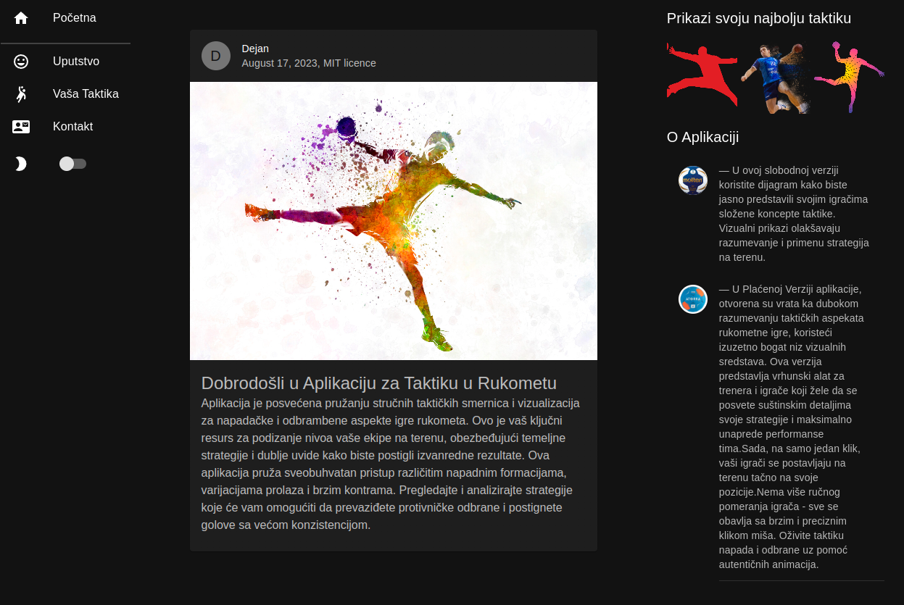
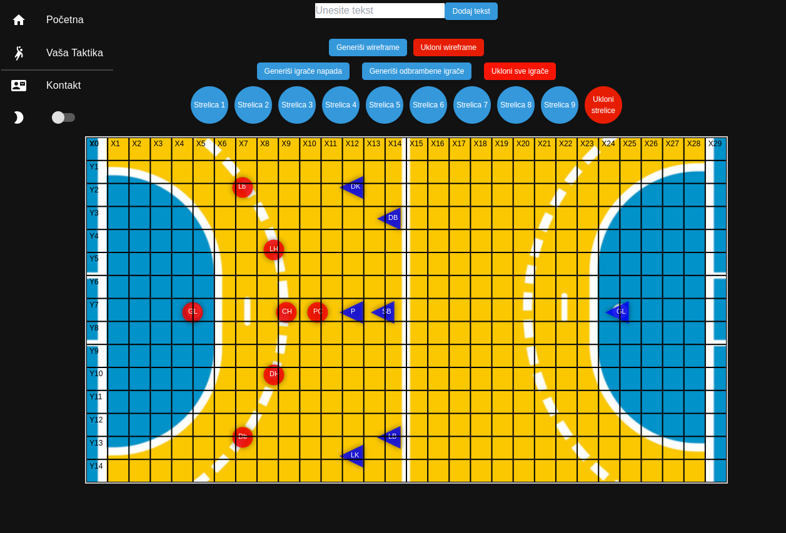

# Handball Court Visualization Application

The Handball Court Visualization Application is a dynamic and interactive React-based platform designed for visualizing handball game scenarios on a virtual court. Leveraging the power of the `react-konva` library for canvas rendering and interaction, this application provides a comprehensive set of features for crafting and analyzing handball strategies.

## Live Preview: [Preview](https://dejan-handball.netlify.app/)

## Screenshots

  
  
  

The Handball Court Visualization Application is a dynamic and interactive React-based platform designed for visualizing handball game scenarios on a virtual court. Leveraging the power of the `react-konva` library for canvas rendering and interaction, this application provides a comprehensive set of features for crafting and analyzing handball strategies.

## Key Features

- **Player Generation**: Seamlessly create teams of handball players by utilizing the "Generate Attack Players" and "Generate Defensive Players" buttons. The players are intuitively positioned based on their designated roles.

- **Player Manipulation**: Effortlessly adjust player positions by employing drag-and-drop functionality. Enhance player orientation by selecting a player and utilizing the rotation button.

- **Arrow Placement**: Illustrate player movements and ball trajectories through intuitive arrow placement. Arrows can be effortlessly dragged, rotated, and removed, facilitating strategic analysis.

- **Text Annotations**: Incorporate textual annotations onto the court by entering descriptive content in the provided input field and clicking "Add Text." These annotations can be conveniently repositioned as needed.

- **Wireframe Generation**: Enhance spatial orientation by generating a structured wireframe grid on the court. This wireframe, created via the "Generate Wireframe" button, serves as a valuable visual reference.

- **Screenshot Generation**: Capture comprehensive visualizations of the court, annotations, and wireframe by initiating the "Screenshot" functionality. A downloadable screenshot in PNG format, named "screenshot.png," is generated.

## Usage Guidelines

1. Initiate player generation by selecting the "Generate Attack Players" and "Generate Defensive Players" buttons, creating distinct player teams.

2. Seamlessly modify player positions by employing intuitive drag-and-drop interactions. Enhance player orientation by activating the rotation feature through the corresponding button.

3. Utilize icon buttons to seamlessly insert arrows, effectively conveying player movements and ball trajectories. Arrows can be effortlessly manipulated, rotated, and deleted.

4. Create descriptive text annotations by entering content into the designated input field and confirming through the "Add Text" button. Annotations can be conveniently repositioned.

5. Elevate spatial orientation by deploying the "Generate Wireframe" button, which overlays a structured grid onto the court. Removal is achieved via the "Remove Wireframe" button.

6. Capture comprehensive visualizations by engaging the "Screenshot" button, facilitating image export for further analysis and documentation.

7. Employ the "Remove All Players" button to clear player entities, and the "Remove All Arrows" button to eliminate all arrow elements.

## Installation Instructions

To facilitate local deployment:

1. Verify the presence of Node.js and npm (Node Package Manager) on your system.

2. Clone the repository and navigate to the project directory.

3. Execute `npm install` to acquire the required dependencies.

4. Initiate the development server by running `npm start`. The application should promptly launch in your default web browser.

## Technologies Utilized

- React.js: A dynamic JavaScript library tailored for crafting intuitive user interfaces.
- `react-konva`: A React-centric encapsulation of the `konva` HTML5 Canvas library, optimizing graphical rendering and interactive experiences.
- `dom-to-image`: A specialized library designed for capturing precise DOM element screenshots.

## Acknowledgments

This application was thoughtfully developed by [Your Name] to fulfill the objectives of [Purpose/Project Name]. Its design and implementation serve as a valuable educational and illustrative asset.

## License

This project is licensed under the [MIT License](LICENSE).
